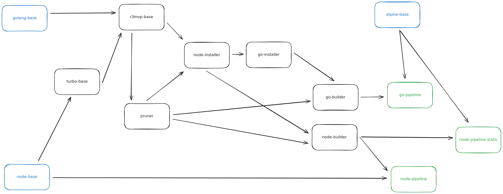

# R3 MVP stack

> This is a fullstack template for blazingly fast MVP development. It is focused on Developer and DevOps experience.

## Tech Stack

- Сommon

  - [PNPM](https://pnpm.io/) - package manager
  - [Turbo](https://turbo.build) - build system
  - [Docker](https://www.docker.com) - deployment system

- Frontend

  - [Vite](https://vitejs.dev) - framework
  - [SolidJS](https://solidjs.com) - library
  - [Router](https://github.com/solidjs/solid-router) - for navigation
  - [Shadcn](https://solid-ui.com) - ui framework
  - [PocketBase SDK](https://github.com/pocketbase/js-sdk) - js-sdk for Pocketbase
  - [TypeScript](https://www.typescriptlang.org) - for type safety

- Backend
  - [Golang](https://golang.org) - for performance
  - [PocketBase](https://pocketbase.io) - Backend As A Service

## Scripts

- `pnpm i --frozen-lockfile` — Install dependencies.
- `pnpm dev` — Starts the application in development mode at (http://localhost:3000).
- `pnpm format` — Format code using Prettier.

## Pipelines
Pipelines are unique way to deploy your services (apps) with configuring only docker-compose file.

Currently we have 3 pre-built pipelines:
 - go-pipeline - for golang apps with binary output
 - node-pipeline - for nodejs apps with nodejs execution output
 - node-pipeline-static - for nodejs apps with static artifact output